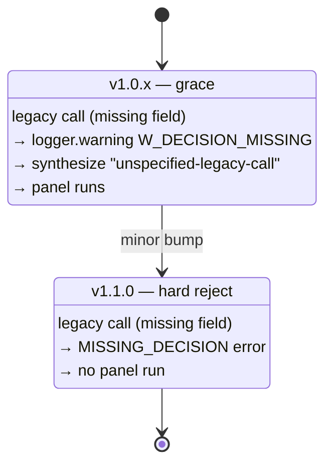

# Migration: v0.12.0 → v1.0.0

> **Audience:** consuming-agent authors first, human operators second. The
> contract is what changes; the CLI surface is largely unchanged.

v1.0.0 freezes the MCP request/response contract. The schema lives in the
package at [`synthpanel/schemas/v1.0.0.json`](../src/synth_panel/schemas/v1.0.0.json)
and is the source of truth for everything below.

## What changed

| Area | v0.12.0 | v1.0.0 |
|---|---|---|
| Decision context on panel calls | Optional / informal | **Required** `decision_being_informed` field |
| Verdict envelope | Loose dict | **`panel_verdict.json`** with `additionalProperties: false` |
| Flags | Free-form strings | **Closed enum** of 7 codes + severity |
| Errors | Mixed shapes | **Typed envelope** with `retry_safe` |
| Schema versioning | None | `schema_version: "1.0.0"` echoed in every response and error |
| Drift handling | Silent partial result | `SCHEMA_DRIFT` typed error (v1.0) → degraded artifact with flag (v1.1) |

## The new requirement: `decision_being_informed`

Every call to `run_panel`, `run_quick_poll`, or `extend_panel` must declare
the decision the panel is informing. `run_prompt` is exempt — it's
sub-decisional scratch work.

### Before (v0.12.0)

```json
{
  "tool": "run_panel",
  "arguments": {
    "stimulus": "price at $49 or $79?",
    "personas": "general-consumer"
  }
}
```

### After (v1.0.0)

```json
{
  "tool": "run_panel",
  "arguments": {
    "stimulus": "price at $49 or $79?",
    "personas": "general-consumer",
    "decision_being_informed": "choosing launch tier price"
  }
}
```

### Constraints

- **Length:** 12–280 chars (trimmed). Below 12 is a label, not a decision; 280
  fits a tweet, forces clarity, survives logs.
- **Single line.** Newlines are rejected.
- **No paraphrase.** Echoed verbatim into `panel_verdict.meta.decision_being_informed`
  and stamped on every transcript row.

### Errors

| Condition | Error code | `retry_safe` |
|---|---|---|
| Field absent / empty / `<12` chars after trim | `MISSING_DECISION` | `false` |
| `>280` chars | `DECISION_TOO_LONG` | `false` |

**No silent truncation.** If you over-shoot 280 chars, you get a typed error,
not a quietly-clipped string.

## Grace window: v1.0 → v1.1

We ship a one-minor grace period for callers who haven't been updated yet.



### v1.0.x behavior

- Missing `decision_being_informed` logs warning `W_DECISION_MISSING`.
- The server synthesizes the literal string `"unspecified-legacy-call"` and
  proceeds with the panel.
- The verdict's `meta.decision_being_informed` will read
  `"unspecified-legacy-call"` — visible in the artifact, visible in
  transcripts.

### v1.1.0 behavior

- Missing `decision_being_informed` returns `MISSING_DECISION` immediately.
- No panel runs. No tokens spent.
- A CHANGELOG entry will mark the cutover.

**Migrate during v1.0.x.** The synthesized placeholder is a transitional
courtesy, not a contract — you'll lose your panel runs the day v1.1 lands if
you haven't added the field.

## Schema-drift behavior (`SYNTHPANEL_DRIFT_DEGRADE`)

The structured-output engine retries malformed responses up to 3 strikes (see
the `sp-d1x0` retry policy). What happens *after* exhaustion changes between
v1.0 and v1.1.

### v1.0.0 — typed error by default

```json
{
  "error_code": "SCHEMA_DRIFT",
  "message": "Structured-output engine exhausted retries.",
  "schema_version": "1.0.0",
  "retry_safe": true
}
```

The agent sees an error and decides — retry, fall back, surface to the user.

### v1.0.0 with `SYNTHPANEL_DRIFT_DEGRADE=1` — opt-in beta of v1.1 behavior

```json
{
  "headline": "...",
  "convergence": 0.62,
  "flags": [
    { "code": "schema_drift", "severity": "warn" }
  ],
  "schema_version": "1.0.0",
  ...
}
```

The panel ran, the agent gets partial signal, the flag is the contract for
"trust this less."

### v1.1.0 — degraded artifact by default

The opt-in becomes default-on. Migration note in the v1.1 CHANGELOG.

### Why the opt-in beta

Winston (architect) and Amelia (dev) agreed independently: ship v1.0 with the
behavior off so MCP-host compat telemetry has a window to surface before the
contract commits. Operators who want v1.1 behavior today flip the flag.

See [docs/mcp.md#host-integration-flags](mcp.md#host-integration-flags) for
the host-side semantics.

## What's not changing

- **Tool names and signatures** for `run_prompt`, `run_panel`,
  `run_quick_poll`, `extend_panel`, and the eight pack/result tools. v0.12
  argument shapes still work — `decision_being_informed` is additive.
- **Persona and instrument YAML formats.** v1/v2/v3 instruments parse
  unchanged.
- **CLI commands and flags.** The CLI surface is for human operators; the
  contract freeze targets the agent-facing MCP tools.
- **MCP transport.** Still stdio JSON-RPC.

## Migration checklist

For agent code that calls SynthPanel via MCP:

- [ ] Add `decision_being_informed` to every `run_panel`, `run_quick_poll`,
      and `extend_panel` call. 12–280 chars, single line.
- [ ] Read `schema_version` from responses and route on it.
- [ ] Switch `flags[]` consumers from string-match to closed-enum lookup.
      Branch on `code` + `severity`; log `extension[]` but don't branch on it.
- [ ] Update error handling to read `error_code` and `retry_safe` instead of
      string-matching `message`.
- [ ] Decide your stance on `SYNTHPANEL_DRIFT_DEGRADE`:
      leave it off (typed error) or flip it on now to preview v1.1.

For MCP host operators:

- [ ] Pin to `synthpanel>=1.0,<2.0` once your callers are migrated.
- [ ] Decide whether to set `SYNTHPANEL_DRIFT_DEGRADE=1` in the env block.
      Document the choice for callers.
- [ ] Plan the v1.1 cutover — the grace window closes when v1.1.0 lands.

## Reference

- Full field-by-field reference: [docs/response-contract.md](response-contract.md)
- Methodology and inspectability: [docs/methodology.md](methodology.md)
- MCP host integration: [docs/mcp.md](mcp.md)
- Schema source: [`src/synth_panel/schemas/v1.0.0.json`](../src/synth_panel/schemas/v1.0.0.json)
