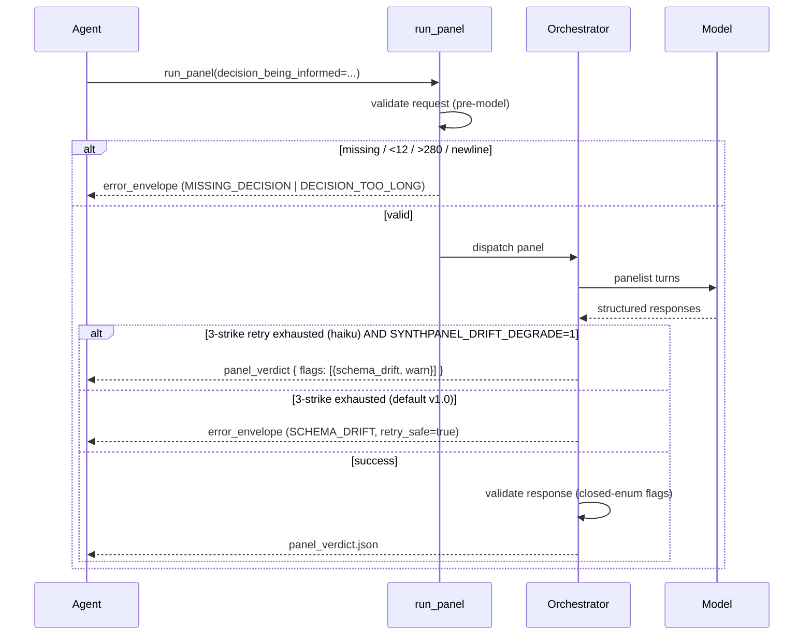

# Response Contract — v1.0.0

The canonical reference for `panel_verdict.json`, the closed `flags[]` enum, and
the typed error envelope. Schema source of truth: [`synthpanel/schemas/v1.0.0.json`](../src/synth_panel/schemas/v1.0.0.json),
embedded in the package — no remote URL, no DNS dependency.

> **Audience:** consuming-agent authors. If you call `run_panel`,
> `run_quick_poll`, or `extend_panel` from agent code, this page tells you what
> comes back and how to branch on it.

## Sequence at a glance



`SYNTHPANEL_DRIFT_DEGRADE` is **off by default in v1.0.0** (typed error on
exhaustion) and **on by default in v1.1.0** (degraded artifact with
`schema_drift` flag). See [docs/migration-v1.md](migration-v1.md) for the grace
window.

## Request: `decision_being_informed`

Required on `run_panel`, `run_quick_poll`, `extend_panel`. Not used on
`run_prompt` (sub-decisional scratch work).

| Property | Value |
|---|---|
| Type | `string` |
| Length | 12–280 chars (trimmed) |
| Encoding | UTF-8 |
| Constraints | Single line — newlines rejected |
| Echoed at | `panel_verdict.meta.decision_being_informed` (verbatim, no paraphrase) |

```json
{
  "decision_being_informed": "choosing launch tier price"
}
```

The verdict is unreadable six months later without the question it was
answering. Echo means the audit log can be joined back to the decision
verbatim.

## Response: `panel_verdict.json`

Returned alongside every successful panel run.

```json
{
  "headline": "Cohort splits on $79; price is the dominant objection.",
  "convergence": 0.74,
  "dissent_count": 3,
  "top_3_verbatims": [
    { "persona_id": "p_07", "quote": "$79 feels like enterprise pricing for a tool I'd use solo." },
    { "persona_id": "p_12", "quote": "$49 says 'indie maker', $79 says 'I have a budget approval process'." },
    { "persona_id": "p_03", "quote": "Price isn't the issue — the value prop hasn't landed yet." }
  ],
  "flags": [
    { "code": "low_convergence", "severity": "warn" }
  ],
  "extension": [],
  "full_transcript_uri": "panel-result://result-20260503-abc123",
  "meta": {
    "decision_being_informed": "choosing launch tier price"
  },
  "schema_version": "1.0.0"
}
```

### Field reference

| Field | Type | Constraint | Notes |
|---|---|---|---|
| `headline` | string | ≤ 140 chars | Model-generated per panel. |
| `convergence` | number | 0.0–1.0 inclusive | **0–1 agreement score your agent can threshold on.** |
| `dissent_count` | integer | ≥ 0 | Count of panelists in the minority position. |
| `top_3_verbatims` | array | 0–3 items | `{persona_id, quote}` objects. v1.0 selection: model-driven with deterministic tie-break on `persona_id`. |
| `flags` | array | closed enum, see below | Set semantics — multiple flags can stack. |
| `extension` | array | open | `{code, message, severity}` for non-enum signals. **Observability only — agents must NOT branch on `extension[]`.** |
| `full_transcript_uri` | string | — | Pointer to saved JSONL transcript. Resolvable via the `panel-result://` MCP resource. |
| `meta.decision_being_informed` | string | verbatim echo | Audit-join key. |
| `schema_version` | string | const `"1.0.0"` | Stamped on every response. |

`additionalProperties: false` — unknown top-level keys are rejected at the
envelope boundary. Branch on `flags[]`, log `extension[]`.

## `flags[]` closed enum

The orchestrator raises all flags post-synthesis, pre-envelope. Synthesizer
and structured-output engine surface signals; orchestrator decides.

| Code | Meaning | Trigger |
|---|---|---|
| `low_convergence` | Inter-persona variance exceeds tolerance | Variance > threshold on primary measure |
| `demographic_skew` | Realized panel drifted from requested quotas | Any quota cell off > 15% post-synthesis |
| `small_n` | Sample too thin for the decision class | n < floor mapped from `decision_being_informed` |
| `persona_collision` | Duplicate/near-duplicate personas inflated agreement | Cosine similarity > 0.92 across ≥ 2 personas |
| `out_of_distribution` | Stimulus outside training/persona coverage | Retrieval confidence below floor |
| `refusal_or_degenerate` | One or more personas refused or returned empty/boilerplate | Parser-level detection |
| `schema_drift` | Degraded artifact returned after 3-strike retry exhaustion | Only fires when `SYNTHPANEL_DRIFT_DEGRADE=1` (default v1.1.0) |

### Severity

Each flag carries `severity: "info" | "warn" | "block"`. Multiple flags can
stack; **highest severity wins** for gating decisions.

### Per-flag examples

```json
{ "code": "low_convergence", "severity": "warn" }
```

```json
{ "code": "demographic_skew", "severity": "warn" }
```

```json
{ "code": "small_n", "severity": "block" }
```

```json
{ "code": "persona_collision", "severity": "info" }
```

```json
{ "code": "out_of_distribution", "severity": "warn" }
```

```json
{ "code": "refusal_or_degenerate", "severity": "warn" }
```

```json
{ "code": "schema_drift", "severity": "warn" }
```

### Branching pattern

```python
verdict = run_panel(stimulus, decision_being_informed="...")

severity_rank = {"info": 0, "warn": 1, "block": 2}
worst = max((severity_rank[f["severity"]] for f in verdict["flags"]), default=-1)

if worst >= severity_rank["block"]:
    raise ResearchBlocked(verdict)
elif any(f["code"] == "low_convergence" for f in verdict["flags"]):
    # Re-run with a wider persona spread or larger n
    ...
elif verdict["convergence"] >= 0.7:
    use_recommendation(verdict["headline"])
```

## Typed error envelope

```json
{
  "error_code": "MISSING_DECISION",
  "message": "decision_being_informed is required for run_panel",
  "field_path": "decision_being_informed",
  "schema_version": "1.0.0",
  "retry_safe": false
}
```

### v1 error codes

| Code | When | `retry_safe` |
|---|---|---|
| `MISSING_DECISION` | Required field absent or `<12` chars after trim | `false` |
| `DECISION_TOO_LONG` | `>280` chars | `false` |
| `INVALID_TOOL_ARG` | Other request validation failure | `false` |
| `INVALID_FLAG` | Response carries a flag not in the closed enum | `false` |
| `SCHEMA_DRIFT` | 3-strike retry exhausted (default v1.0) **or** degraded artifact itself fails re-validation | `true` (pre-exhaustion) |
| `MODEL_TIMEOUT` | Provider timeout | `true` |
| `INTERNAL_ERROR` | Uncategorized server-side failure | `false` |

`retry_safe = true` only for `MODEL_TIMEOUT` and `SCHEMA_DRIFT` pre-exhaustion.
Treat `retry_safe = false` as terminal — fix the request, don't retry the call.

### Validation boundary

Validation runs at **both sides** of structured-output:

- **Request side** — validated *before* model invocation. Cheap reject, no
  token spend.
- **Response side** — validated *after* model returns, *before* the artifact
  leaves the server. Enforces the closed `flags[]` enum and
  `additionalProperties: false`.

Fail fast, fail closed.

## Schema asset

Single file, embedded in the package:
[`synthpanel/schemas/v1.0.0.json`](../src/synth_panel/schemas/v1.0.0.json).
Append-only — new contract versions ship as parallel files
(`v1.1.0.json`, `v2.0.0.json`), never as in-place edits.

`schema_version` is echoed in every response and every error. Pin to it for
forward-compat — when v1.1 lands, your agent reads `schema_version` and routes.

## Out of scope for v1.0.0

Explicitly deferred:

- User-facing real-data anchoring / calibration to the caller's own data
- Human-facing dashboard
- Pack registry as a published artifact
- MCP host compatibility matrix
- Persona embedding tuning
- Convergence-score parity check across CLI-sonnet vs MCP-haiku (soft gate)
